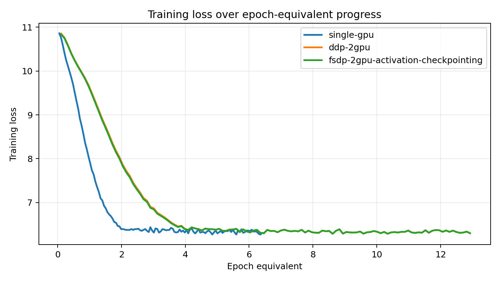
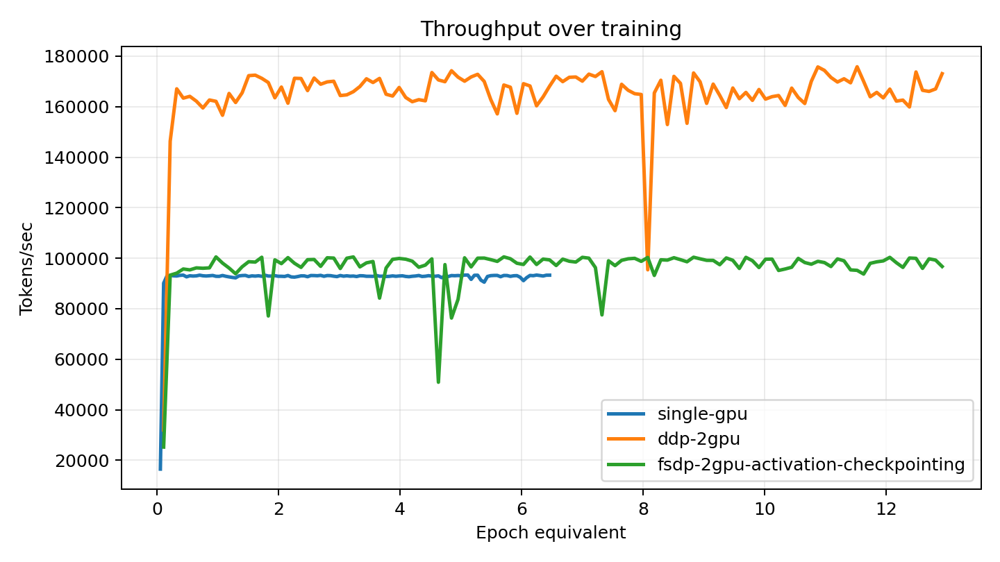
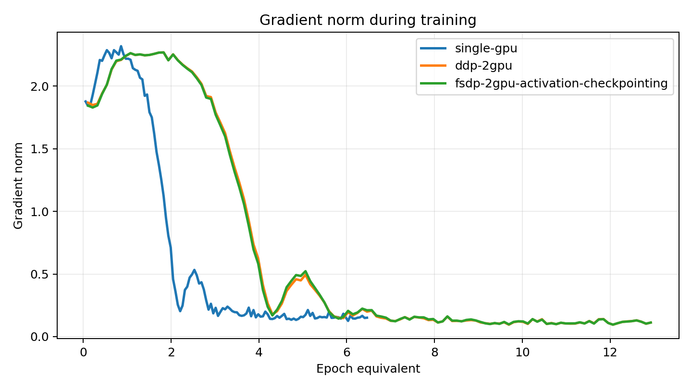
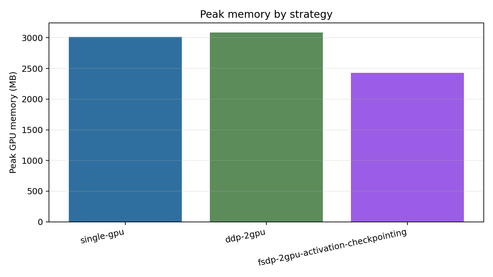

# Distributed Transformer

Decoder-only Transformer training with PyTorch DDP and FSDP. The project is an
experiment-oriented implementation for measuring distributed training throughput,
memory use, scaling efficiency, checkpoint overhead, and training stability.

## What is implemented

- GPT-style decoder-only Transformer in PyTorch
- `torchrun` launch path for DDP and FSDP
- FP16/BF16 mixed precision
- Activation checkpointing
- Gradient accumulation
- Checkpoint save/resume with optimizer state
- Per-step JSONL metrics for loss, grad norm, tokens/sec, peak memory, checkpoint time, and epoch-equivalent progress
- Benchmark plots generated from recorded metrics

## Install

```bash
uv venv
uv pip install -r requirements.txt
```

Use a CUDA PyTorch build that supports your GPU architecture. The recorded
benchmarks used PyTorch `2.12.0+cu130`.

## Smoke test

```bash
uv run python train.py \
  --dataset synthetic \
  --max-steps 2 \
  --batch-size 2 \
  --grad-accum-steps 1 \
  --context-length 32 \
  --embedding-dim 64 \
  --num-layers 2 \
  --num-heads 4 \
  --precision fp32 \
  --benchmark-name smoke-single
```

## Experiment commands

Single GPU:

```bash
CUDA_VISIBLE_DEVICES=0 uv run python train.py \
  --strategy single \
  --dataset tinyshakespeare \
  --max-steps 120 \
  --warmup-steps 10 \
  --eval-interval 20 \
  --eval-iters 10 \
  --save-interval 120 \
  --batch-size 16 \
  --grad-accum-steps 4 \
  --context-length 256 \
  --embedding-dim 256 \
  --num-layers 6 \
  --num-heads 4 \
  --precision fp16 \
  --benchmark-name single-gpu-tinyshakespeare
```

DDP on two GPUs:

```bash
uv run torchrun --standalone --nproc_per_node=2 train.py \
  --strategy ddp \
  --dataset tinyshakespeare \
  --max-steps 120 \
  --warmup-steps 10 \
  --eval-interval 20 \
  --eval-iters 10 \
  --save-interval 120 \
  --batch-size 16 \
  --grad-accum-steps 4 \
  --context-length 256 \
  --embedding-dim 256 \
  --num-layers 6 \
  --num-heads 4 \
  --precision fp16 \
  --benchmark-name ddp-2gpu-tinyshakespeare \
  --baseline-tokens-sec 92876.59029197277
```

FSDP on two GPUs with activation checkpointing:

```bash
uv run torchrun --standalone --nproc_per_node=2 train.py \
  --strategy fsdp \
  --dataset tinyshakespeare \
  --max-steps 120 \
  --warmup-steps 10 \
  --eval-interval 20 \
  --eval-iters 10 \
  --save-interval 120 \
  --batch-size 16 \
  --grad-accum-steps 4 \
  --context-length 256 \
  --embedding-dim 256 \
  --num-layers 6 \
  --num-heads 4 \
  --precision fp16 \
  --activation-checkpointing \
  --benchmark-name fsdp-2gpu-tinyshakespeare \
  --baseline-tokens-sec 92876.59029197277
```

Summarize metrics:

```bash
uv run python summarize_benchmarks.py results/tinyshakespeare/single-gpu.jsonl
```

Generate plots:

```bash
uv run python plot_benchmarks.py \
  --runs \
  results/tinyshakespeare/single-gpu.jsonl \
  results/tinyshakespeare/ddp-2gpu.jsonl \
  results/tinyshakespeare/fsdp-2gpu-activation-checkpointing.jsonl \
  --output-dir assets
```

## Benchmark setup

- Hardware: 2x NVIDIA RTX PRO 4000 Blackwell, 24,467 MiB VRAM per GPU
- Driver: 580.159.04
- CUDA runtime reported by `nvidia-smi`: 13.0
- PyTorch: 2.12.0+cu130
- Dataset: TinyShakespeare tokenized with GPT-2 BPE
- Model: 6 layers, 4 heads, 256 hidden size, 256 context length
- Training: FP16, batch size 16 per rank, 4 gradient accumulation steps
- Run length: 120 optimizer steps

## Results

The first step is excluded from throughput summaries to remove compile and warmup
effects. Epoch-equivalent progress is computed from global tokens processed over
the training split token count.

| Run | GPUs | Strategy | Epoch-equivalent | Final train loss | Final eval loss | Tokens/sec | Peak memory | Checkpoint time | Scaling efficiency |
|---|---:|---|---:|---:|---:|---:|---:|---:|---:|
| single-gpu | 1 | single | 6.46 | 6.298 | 6.481 | 92,877 | 3,015 MB | 0.684 s | n/a |
| ddp-2gpu | 2 | DDP | 12.93 | 6.298 | 6.482 | 166,045 | 3,087 MB | 0.669 s | 0.894 |
| fsdp-2gpu-activation-checkpointing | 2 | FSDP | 12.93 | 6.298 | 6.482 | 97,080 | 2,428 MB | 0.929 s | 0.523 |

## Plots









## Findings

- DDP improved throughput from `92,877` to `166,045` tokens/sec, reaching `0.894` two-GPU scaling efficiency.
- FSDP with activation checkpointing reduced peak memory from `3,087 MB` under DDP to `2,428 MB`, a `21.3%` reduction for the same two-GPU workload.
- FSDP throughput was lower than DDP because sharding communication and activation recomputation dominated this small model.
- Checkpoint overhead was modest for single-GPU and DDP runs. FSDP checkpointing was slower because full model and optimizer state are materialized from sharded state.
- Gradient norms peaked during the high-learning-rate early phase, then settled as training loss flattened near `6.3`.

## Checkpoint resume

Single-GPU and FSDP checkpoints were both resumed from the final checkpoint and
completed one additional optimizer step.

Single-GPU resume:

```bash
CUDA_VISIBLE_DEVICES=0 uv run python train.py \
  --strategy single \
  --dataset tinyshakespeare \
  --resume outputs/single-gpu-tinyshakespeare/checkpoints/step_000119.pt \
  --max-steps 121 \
  --batch-size 16 \
  --grad-accum-steps 4 \
  --context-length 256 \
  --embedding-dim 256 \
  --num-layers 6 \
  --num-heads 4 \
  --precision fp16 \
  --benchmark-name resume-single-gpu
```

FSDP resume:

```bash
uv run torchrun --standalone --nproc_per_node=2 train.py \
  --strategy fsdp \
  --dataset tinyshakespeare \
  --resume outputs/fsdp-2gpu-tinyshakespeare/checkpoints/step_000119.pt \
  --max-steps 121 \
  --batch-size 16 \
  --grad-accum-steps 4 \
  --context-length 256 \
  --embedding-dim 256 \
  --num-layers 6 \
  --num-heads 4 \
  --precision fp16 \
  --activation-checkpointing \
  --benchmark-name resume-fsdp-2gpu
```
